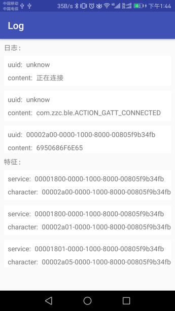
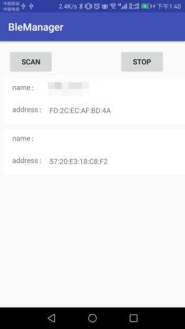
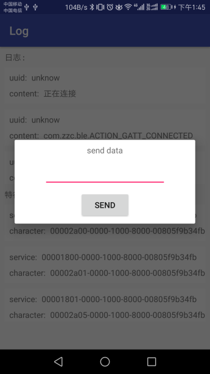

# BleManager
    对Ble的封装，入口为BleManager。  
    

### 使用方法
    ```
    AbsBleManager manager = BleManager.getInstance(context);
    if(manager.isVisible()){
        manager.open(activity,new BleOpenListener() {
            @Override
            public void result(boolean open) {
                if (open) {
                    manager.scan(new BluetoothAdapter.LeScanCallback() {
                             @Override
                             public void onLeScan(BluetoothDevice bluetoothDevice, int i, byte[] bytes) {
                                //获取附近蓝牙设备
                                if(yourDevice){
                                    manager.connect(bluetoothDevice.getAddress());
                                }
                             }
                         }, new Runnable() {
                             @Override
                             public void run() {
                                //扫描结束
                             }
                         }, 5000);
                }
            })
    }
    
    //接收连接事件和数据
    manager.registerBluetooth(this);
    
    //发送数据
    manager.sendData(new byte[],serviceUUID,characterUUID);
    
    //断开连接
    manager.disconnect();
    ```
    需要动态获取权限
    `<uses-permission android:name="android.permission.ACCESS_COARSE_LOCATION"/>`
    
    静态权限
    ```
     <uses-permission android:name="android.permission.BLUETOOTH"/>
        <uses-permission android:name="android.permission.BLUETOOTH_ADMIN"/>
    ```

### 截图


