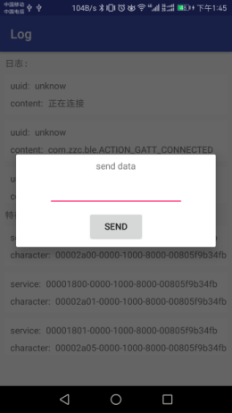

# BleManager
    对Ble的封装，入口为BleManager。  
    提供Sample，可以连接周围Ble设备，支持发送数据与接收数据

### 使用方法
    AbsBleManager manager = BleManager.getInstance(context);
    if(manager.isVisible()){
        manager.open(activity,new BleOpenListener() {
            @Override
            public void result(boolean open) {
                if (open) {
                    manager.scan(new BluetoothAdapter.LeScanCallback() {
                             @Override
                             public void onLeScan(BluetoothDevice bluetoothDevice, int i, byte[] bytes) {
                                //获取附近蓝牙设备
                                if(yourDevice){
                                    manager.connect(bluetoothDevice.getAddress());
                                }
                             }
                         }, new Runnable() {
                             @Override
                             public void run() {
                                //扫描结束
                             }
                         }, 5000);
                }
            })
    }
    
    //接收连接事件和数据
    manager.registerBluetooth(this);
    
    //发送数据
    manager.sendData(new byte[],characterUUID，serviceUUID);
    
    //断开连接
    manager.disconnect();
    
    需要动态获取权限
    <uses-permission android:name="android.permission.ACCESS_COARSE_LOCATION"/>
    
    静态权限
     <uses-permission android:name="android.permission.BLUETOOTH"/>
        <uses-permission android:name="android.permission.BLUETOOTH_ADMIN"/>
   

### 截图

### Download
    <dependency>
       <groupId>com.zzc</groupId>  
       <artifactId>blemanager</artifactId>  
       <version>1.0.0</version>
       <type>pom</type>
     </dependency>  
or :  
`compile 'com.zzc:blemanager:1.0.0'`

### License
    Copyright 2015 Zzechen.
    
    Licensed under the Apache License, Version 2.0 (the "License");
    you may not use this file except in compliance with the License.
    You may obtain a copy of the License at
    
       http://www.apache.org/licenses/LICENSE-2.0
    
    Unless required by applicable law or agreed to in writing, software
    distributed under the License is distributed on an "AS IS" BASIS,
    WITHOUT WARRANTIES OR CONDITIONS OF ANY KIND, either express or implied.
    See the License for the specific language governing permissions and
    limitations under the License.
